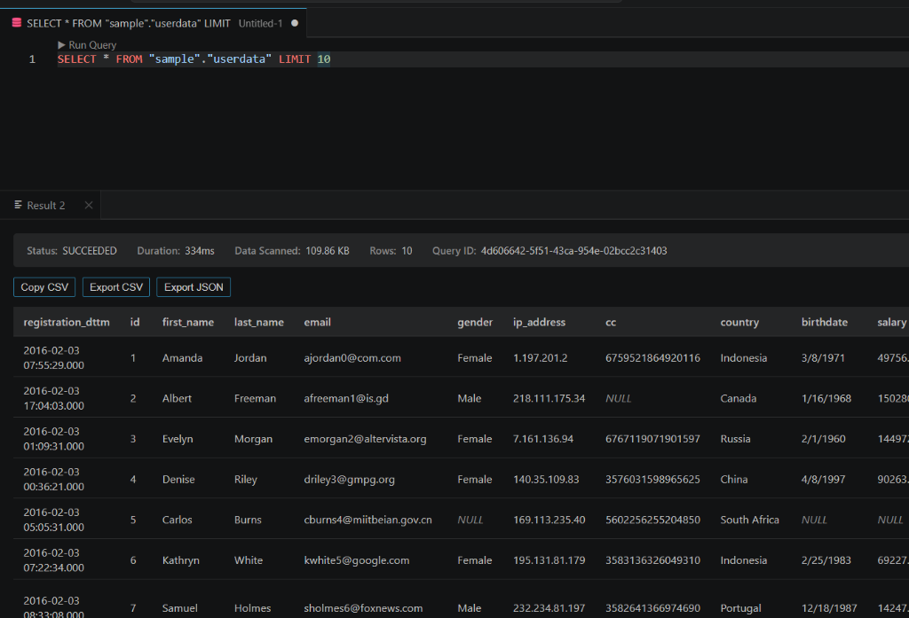
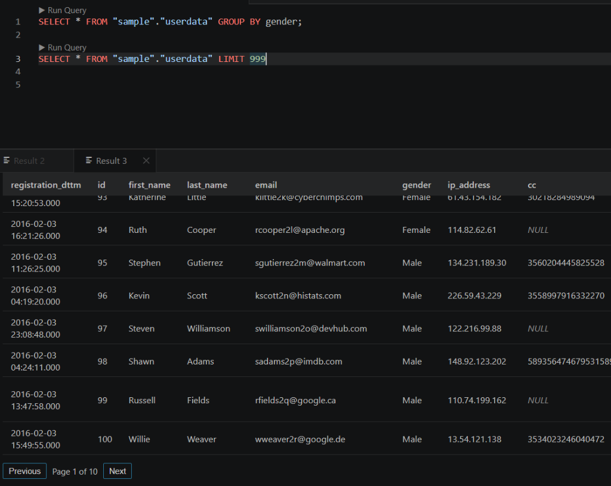
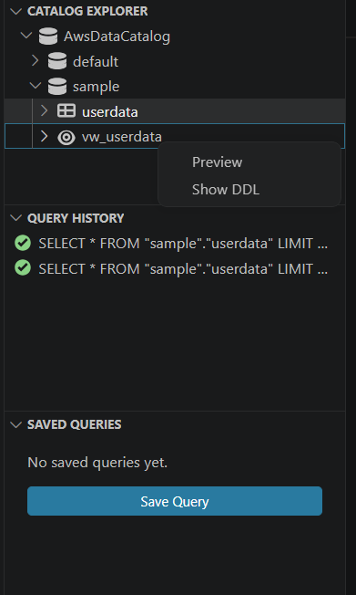
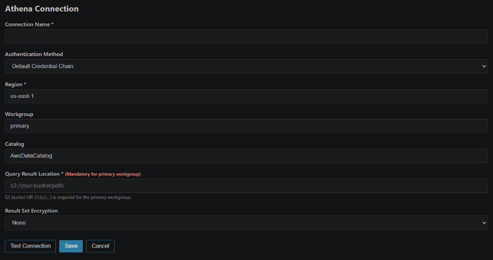
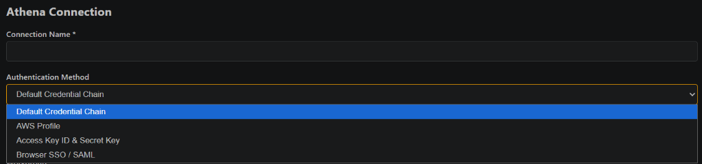

# AWS Athena SQL Client

A lightweight, production-ready Visual Studio Code extension for **Amazon Athena** and **AWS Glue Data Catalog**. Query data lakes, browse catalogs and schemas, manage multiple connections with Browser SSO/IAM, track query history with pagination, and inspect results with built-in export capabilities.

---

## 🌟 Key Features

### 1. Multi-Tab SQL Editor & Query Execution
- **CodeLens Integration**: Automatically displays **"▶ Run Query"** above individual SQL statements (`SELECT`, `WITH`, `CREATE`, `INSERT`, etc.) in `.sql` files.
- **Flexible Execution**: Run the statement under the cursor, highlighted SQL selection, or the entire file via `Ctrl+Enter` (`Cmd+Enter` on macOS) or the editor title bar button.
- **In-Flight Cancellation**: Cancel running queries cleanly at any moment via `athena.cancelQuery` or the notification progress bar.

### 2. Query Results Panel
- **Horizontal Split Layout**: Results automatically open in a dedicated panel directly below your SQL editor for seamless query-and-inspect workflows.
- **Multi-Tab Results**: Each query run produces an independent result tab (`Result 1`, `Result 2`, ...) without overwriting prior query outputs.
- **Pagination & Metrics**: Fast client-side pagination with row counts, execution duration, data scanned (in KB/MB/GB), and AWS Query Execution ID.
- **Data Exporting**:
  - **Copy CSV**: Instant clipboard copy.
  - **Export CSV**: Prompts file save dialog and saves tabular data to `.csv`.
  - **Export JSON**: Formats and exports data as structured JSON.
- **Native Theme Styling**: Matches VS Code native dark, light, and high-contrast themes using standard design tokens.

---

### 3. Catalog / Schema / Table Explorer (`athena.explorer`)
- **Hierarchical 4-Level Tree**:
  - `Data Catalog` (e.g., `AwsDataCatalog`)
  - `Database / Schema`
  - `Tables & Views` (distinct icons for physical tables vs virtual views)
  - `Columns` (column name, data type, and partition key badges)
- **High Performance & Zero Query Cost**: Reads catalog metadata via AWS Glue APIs (`GetDatabases`, `GetTables`, `GetTable`), avoiding Athena scan costs.
- **Productive Context Menus**:
  - **Preview Table (First 50 Rows)**: Instantly generates and runs a `SELECT * FROM ... LIMIT 50` query.
  - **Show Table DDL**: Executes `SHOW CREATE TABLE` to view full table schema and partition specs.
  - **Copy Table Name**: Quick clipboard copy for rapid SQL drafting.

### 4. Query History (`athena.history`)
- **Chronological Execution Log**: Sorted descending by submission time with clear status indicators (`SUCCEEDED`, `FAILED`, `RUNNING`, `CANCELLED`).
- **Paginated Navigation**: Configurable page navigation (5 queries per page, up to 50 items) right in the view header.
- **Execution Metrics on Hover**: Inspect duration, data scanned, submission time, and complete error diagnostics via rich Markdown tooltips.
- **Click-to-Open**: Click any history entry to open the executed SQL statement in a fresh editor tab.

### 5. Saved Queries (`athena.savedQueries`)
- **Local & File-Backed Storage**: Queries are saved locally to `.vscode/athena-saved-queries.json` or user profile for full lifecycle control, privacy, and team version-control.
- **One-Click Execution**: Click any saved query to open it directly in the main SQL editor.
- **Easy Management**: Save from the active editor with the `+` icon, rename, or delete at any time.

---

### 6. Connection Management (`athena.connections`)
- **Multi-Profile Support**: Manage multiple Athena environments (dev, staging, prod) with instant active-connection switching.
- **Interactive Configuration Panel**:
  - **Connection Name**: Unique name per connection.
  - **AWS Region & Workgroup**: Target specific AWS regions and Athena workgroups.
  - **Catalog & S3 Result Location**: Dynamic validation for S3 output locations with automatic requirement checks.
  - **Encryption Support**: Built-in support for `NONE`, `SSE_S3`, `SSE_KMS`, and `CSE_KMS` with KMS Key ARN configuration.
  - **Test Connection**: Instant background ping (`ListWorkGroupsCommand`) with real-time green/red health indicators.

- **Comprehensive Authentication Options**:
  - **Default Credential Chain**: Standard AWS SDK provider chain (environment variables, IAM roles, ECS/EC2 metadata).
  - **AWS Profile**: Use local profiles configured in `~/.aws/credentials` and `~/.aws/config`.
  - **Access Key ID & Secret Key**: Securely stored using VS Code `SecretStorage` with OS-level keychain encryption.
  - **Interactive Browser SAML Login**: Automated login for Okta, Azure AD / Entra ID, Ping Identity, etc. Launches your system browser (Edge/Chrome), intercepts role selection, acquires STS credentials, and auto-closes the browser window.
  - **AWS IAM Identity Center (SSO)**: Direct authentication via AWS SSO Start URL and AWS IAM Identity Center.

---

## 🔒 Security & Best Practices
- **Credentials Protection**: Sensitive AWS keys are stored strictly in VS Code `SecretStorage` (`context.secrets`) using OS-level keychain encryption. Non-sensitive configurations are stored in `globalState`.
- **Content Security Policy (CSP)**: All Webviews use strict CSP meta tags with unique cryptographic nonces.
- **Zero Heavy Runtimes**: Pure TypeScript and lightweight AWS SDK v3 modular packages without unnecessary chromium or heavy browser dependencies.

---

## 💬 Support & Feedback

If you encounter any issues, have feature requests, or need help, please feel free to open an issue on our GitHub repository:

👉 **[Submit an Issue / Feature Request](https://github.com/san-kush/aws-athena-sql-client/issues)**

Contributions, suggestions, and feedback are always welcome!

---

## 📄 License
MIT © [sankush](https://github.com/san-kush)
